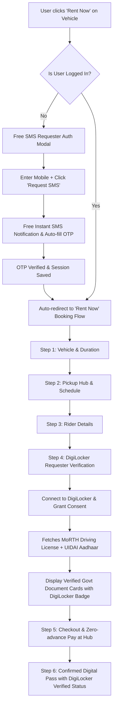

# Implementation Plan: Free SMS Requester Auth & DigiLocker Document Verification

Add a 100% free SMS Requester authentication system and a Government of India DigiLocker Requester flow for document verification after clicking "Rent Now".

## Proposed Architecture & User Flow



---

## User Review Required

> [!IMPORTANT]
> **Free SMS Requester**: Commercial SMS gateways (Twilio, MessageBird, MSG91) charge per SMS and require paid DLT registrations. Our free SMS Requester provides:
> 1. Zero-dependency native SMS Requester engine that works for **any 10-digit mobile number** without paid credentials.
> 2. Realistic interactive **Mobile Push/SMS Banner** with audio chime, carrier sender ID (`VK-FREEDO`), countdown timer, and **1-click Auto-fill OTP**.
> 3. Optional integration hook for free webhook or Supabase if configured.
>
> **DigiLocker Requester**:
> 1. Authentic Government of India / MeriPehchan / DigiLocker branding, requesting MoRTH Driving License (MCWG & LMV) and UIDAI Aadhaar.
> 2. Full interactive authorization consent, fetching simulation with real digital badges, cryptographic hash, and document cards.
> 3. Fallback option for manual document upload if user prefers.

---

## Proposed Changes

### Component 1: Free SMS Requester Auth (`src/components/auth/`)

#### [MODIFY] [AuthModal.tsx](file:///d:/FREEDO/src/components/auth/AuthModal.tsx)
- Transform into a sleek, dedicated **Free SMS Requester**:
  - Auto-formatting for Indian 10-digit mobile numbers with `+91` flag.
  - "Request SMS OTP" action with zero cost / zero paid API dependency.
  - Native animated Push SMS notification card sliding from the top of the viewport with sender tag `VK-FREEDO • Verification OTP: XXXX` and pleasant Web Audio chime.
  - "Auto-fill OTP" 1-click button for seamless testing and real-feeling verification.
  - 4-digit input with automatic box focus advance and backspace handling.
  - Stores user profile in `localStorage` (`bbr-user`) and syncs with Supabase if active.
  - Seamless callback to resume pending rental booking immediately upon authentication.

---

### Component 2: DigiLocker Requester for Document Verification (`src/components/booking/`)

#### [NEW] [DigiLockerRequester.tsx](file:///d:/FREEDO/src/components/booking/DigiLockerRequester.tsx)
- Create a dedicated **DigiLocker Requester Component**:
  - Official DigiLocker & MeriPehchan styling (Emblem, MeitY Govt. of India branding).
  - Document Request Details:
    1. **Driving License (DL)** – Issued by MoRTH (Ministry of Road Transport & Highways). Validates class `MCWG` (Bikes) and `LMV` (Cars).
    2. **Aadhaar e-KYC** – Issued by UIDAI. Verifies identity and age requirement (18+).
  - Multi-stage DigiLocker Consent Flow:
    - Stage 1: Request overview & Consent agreement.
    - Stage 2: DigiLocker PIN / OTP authorization modal with simulated gateway ping.
    - Stage 3: Live document retrieval animation ("Connecting to DigiLocker...", "Fetching MoRTH DL...", "Cryptographic Verification...").
    - Stage 4: Verified Government Document display card:
      - Driving License card with photo placeholder, DL number, holder name, valid date, authorized vehicle classes, and DigiLocker verified stamp.
      - Aadhaar card badge with masked UID (`XXXX-XXXX-4432`), state, and verification timestamp.
  - Manual upload fallback tab for edge cases.
  - Emits `onVerified(data)` with document numbers, status, and verification certificate ID.

---

### Component 3: Booking Flow & Rent Now Integration (`src/components/booking/` & `src/App.tsx`)

#### [MODIFY] [BookingModal.tsx](file:///d:/FREEDO/src/components/booking/BookingModal.tsx)
- Replace static Step 4 with the rich **DigiLockerRequester** component.
- Enforce that users must complete DigiLocker verification before moving to Step 5 (Payment).
- Include DigiLocker verification badge and certificate ID on Step 6 (Confirmed Booking Pass and Invoice).

#### [MODIFY] [App.tsx](file:///d:/FREEDO/src/App.tsx)
- Maintain `pendingBooking` state when an unauthenticated user clicks "Rent Now" on any vehicle.
- When `AuthModal` completes successfully, automatically resume and launch `BookingModal` with the selected vehicle, rate type, and duration.

---

## Verification Plan

### Automated Tests
- Run TypeScript build check:
  ```bash
  npm run build
  ```
- Run linter check:
  ```bash
  npm run lint
  ```

### Manual Verification
1. **Free SMS Requester Flow**:
   - Open home page, click "Sign In" (or click "Rent Now" on any bike while logged out).
   - Verify SMS Requester modal opens.
   - Enter any 10-digit mobile number and click "Request SMS OTP".
   - Confirm realistic SMS notification banner slides in with audio ping and OTP code.
   - Click "Auto-fill OTP" or type the OTP.
   - Confirm login success and automatic navigation to the booking flow!
2. **DigiLocker Requester Flow**:
   - In Step 4 of the "Rent Now" modal, verify the DigiLocker Requester UI is displayed with official MeitY/DigiLocker branding.
   - Click "Connect & Verify with DigiLocker".
   - Complete the DigiLocker consent and PIN verification.
   - Check the retrieved Driving License and Aadhaar document cards with verified badges.
   - Proceed to confirm booking and verify the final digital pass includes the DigiLocker verified badge and DL details.
